# fcitx5-mellow-themes-legacy

Aesthetic, modern fcitx5 theme featuring rounded rectangle design. Intended for “X11, HiDPI” environment.

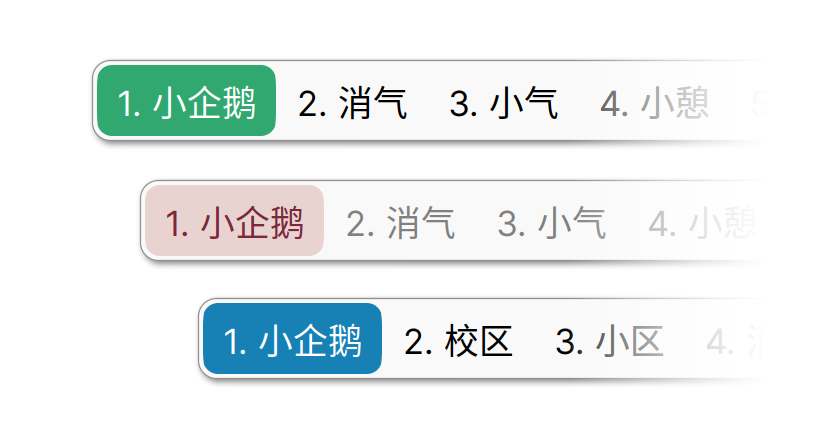

## Notice

Intended for “X11, HiDPI” environment.

For users of:

- X11, LoDPI

- Wayland, LoDPI

- Wayland, HiDPI

  Check [fcitx5-mellow-themes](https://github.com/sanweiya/fcitx5-mellow-themes)

## Usage

### Manual Installation

Install for the current user: 

```
git clone https://github.com/sanweiya/fcitx5-mellow-themes-legacy.git
```

```
cd fcitx5-mellow-themes-legacy/
```

```
mkdir -p ~/.local/share/fcitx5/themes && cp -r ./mellow-* ~/.local/share/fcitx5/themes
```

## Screenshots

- **Youlan 釉蓝**
  
  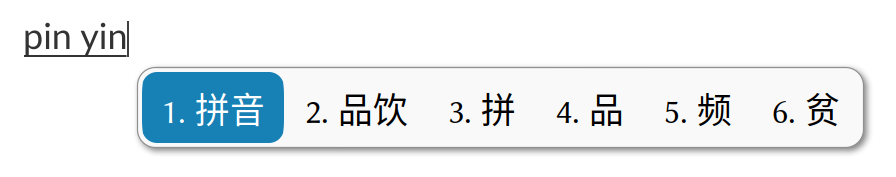 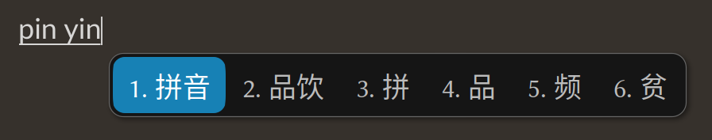
  
- **Sakura 灰樱**
  
  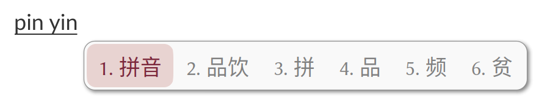 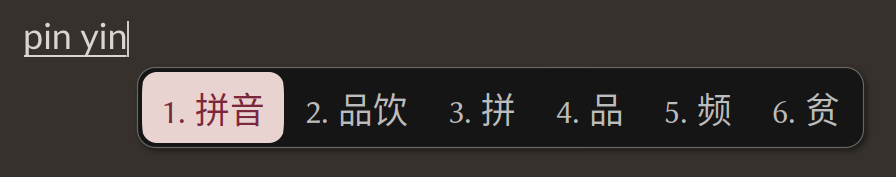
  
- **Vermilion 朱砂**
  
  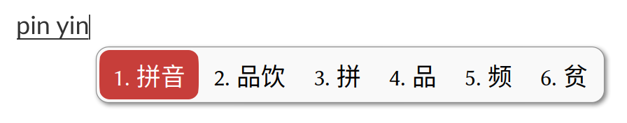 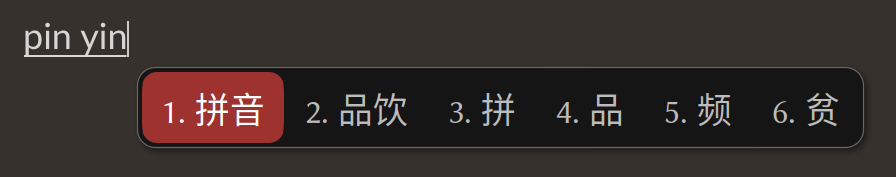
  
- **Wechat 微言**
  
  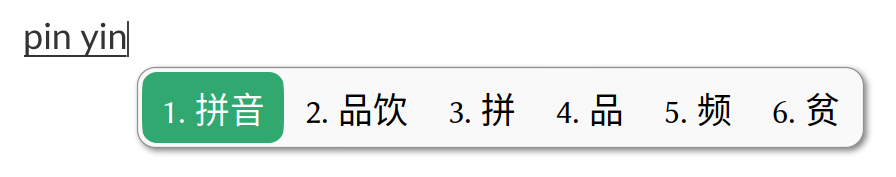 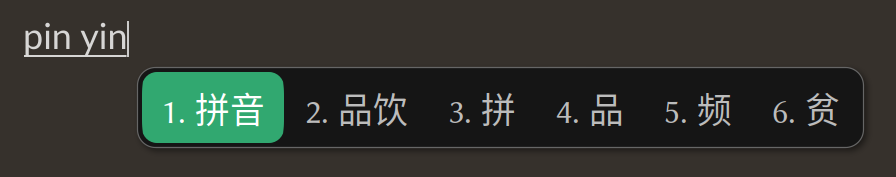
  
- **Graphite 石墨**
  
  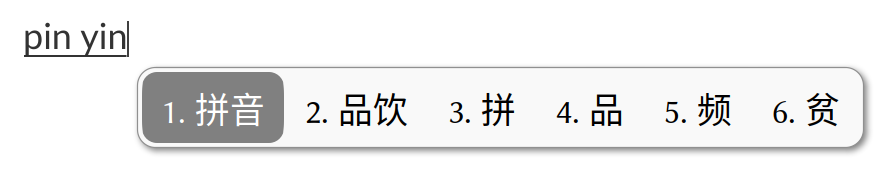 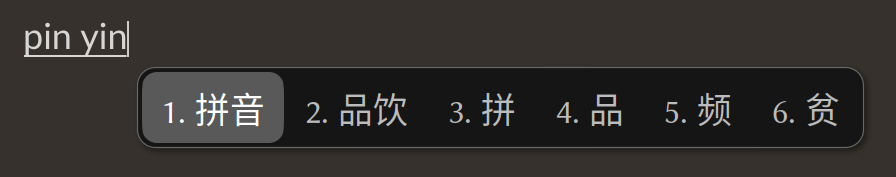
  
- **Vertical & Dual-line**
  
  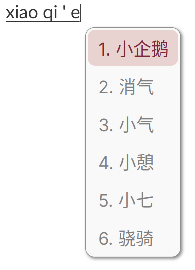 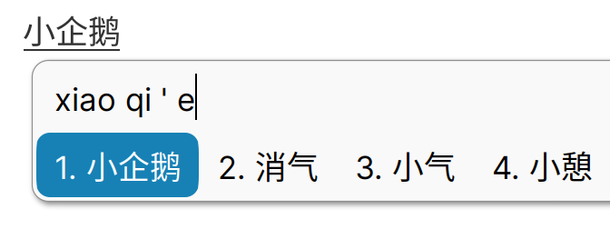

## EOF
